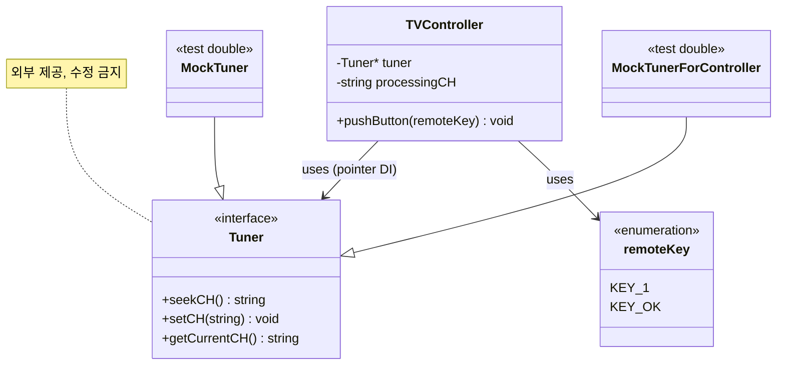

# TDD_TV_Init 코드베이스 구조 분석

| 항목 | 내용 |
|------|------|
| 분석 일자 | 2026-05-19 |
| 대상 저장소 | `TDD_TV_Init` (project: `bestreviewer`) |
| 소스 범위 | `include/`, `test/`, `CMakeLists.txt`, `README.md` |

---

## 1. 프로젝트 전체 구조

### 1.1 디렉터리 개요

```
TDD_TV_Init/
├── CMakeLists.txt          # C++17, FetchContent(googletest 1.14.0), 2개 테스트 타깃
├── README.md               # 기능 명세 (6개 시나리오)
├── .cursorrules            # Cursor AI 개발 규칙
├── include/                # 프로덕션 헤더 (src/ 없음, 헤더 중심 구현)
│   ├── Tuner.h             # 외부 Tuner 인터페이스 (수정 금지)
│   ├── TVController.h      # 채널 제어 컨트롤러 (구현 대상)
│   └── remoteKey.h         # 리모컨 키 enum
├── test/
│   ├── TunerTest.cpp       # Tuner 계약·GMock 참고 테스트
│   └── TVControllerTest.cpp# Controller 테스트 (스켈레톤)
└── Report/                 # 설계·진행 보고서
```

- **빌드 산출물** `build/`, FetchContent `_deps/`는 소스 트리에 포함되지 않음.
- `include/FakeTuner.h`, `include/MockTuner.h`, `test/FakeTunerTest.cpp` 등은 **과거 빌드 캐시에만 흔적**이 있으며, **현재 워크스페이스 소스에는 존재하지 않음**.

### 1.2 아키텍처 레이어

```
┌─────────────────────────────────────────────────────────┐
│  test/ (Google Test + Google Mock)                       │
│  TunerTest, TVControllerTest                             │
└──────────────────────────┬──────────────────────────────┘
                           │ uses
┌──────────────────────────▼──────────────────────────────┐
│  include/ — 애플리케이션 계층                             │
│  TVController  ──uses──►  remoteKey (입력)                │
│       │                                                   │
│       │ depends on (DI)                                   │
│       ▼                                                   │
│  Tuner (abstract) ◄── 외부 업체 제공, 구현체 없음          │
└─────────────────────────────────────────────────────────┘
```

**설계 스타일**: 헥사고날/포트-어댑터에 가까운 형태. `Tuner`가 **아웃바운드 포트**, `remoteKey` + `pushButton`이 **인바운드 어댑터** 역할. Controller가 도메인 오케스트레이션을 담당한다.

---

## 2. 주요 클래스·타입 역할과 책임

### 2.1 `Tuner` (`include/Tuner.h`)

| 항목 | 내용 |
|------|------|
| **역할** | 채널 튜닝 하드웨어/드라이버에 대한 **외부 추상 인터페이스** |
| **책임** | 현재 채널 조회, 지정 채널 설정, 시청 가능 채널 검색 |
| **소유** | Tuner 업체 (Samsung 저작권 헤더) — **시그니처 변경 금지** |
| **구현** | 저장소 내 **구체 클래스 없음** |

**공개 API**

| 메서드 | 책임 |
|--------|------|
| `seekCH()` | 현재 채널에서 증가 방향으로 시청 가능 채널 검색 후 변경·반환 |
| `setCH(const std::string&)` | 지정 채널(문자열)로 변경 |
| `getCurrentCH()` | 현재 채널 문자열 반환 |

채널은 `std::string` (`"0"` ~ `"99"`). 무효 채널 시 `std::invalid_argument` 가능(테스트에서 Mock으로만 검증).

---

### 2.2 `TVController` (`include/TVController.h`)

| 항목 | 내용 |
|------|------|
| **역할** | 리모컨 입력을 해석해 **채널 변경·선호·검색·업다운** 등을 오케스트레이션 (목표) |
| **현재 상태** | **스켈레톤** — `KEY_1`, `KEY_OK`만 처리 |
| **책임 (설계 의도)** | 입력 버퍼 관리, README 시나리오별 로직, `Tuner` 호출 |
| **책임 (현재 구현)** | `processingCH`에 숫자 누적, 확인 시 로그만 출력 |

**멤버**

| 멤버 | 타입 | 책임 |
|------|------|------|
| `tuner` | `Tuner*` | 생성자 주입 — 실제 Tuner에 의존하지 않음 (테스트용 더블 주입) |
| `processingCH` | `std::string` | 숫자 입력 중간 버퍼 (미확정 채널 문자열) |

**공개 API**

| 메서드 | 책임 |
|--------|------|
| `TVController(Tuner*)` | Tuner 포인터 주입 (explicit) |
| `pushButton(remoteKey)` | 리모컨 키 1건 처리 — 현재 `switch` 분기 |

**미구현 (README 기준)**  
선호 채널 목록, 채널 검색 결과 저장, 업/다운(검색 유/무), 숫자 0~9 전체, `tuner->setCH` 실제 호출(주석 처리됨).

---

### 2.3 `remoteKey` (`include/remoteKey.h`)

| 항목 | 내용 |
|------|------|
| **역할** | 리모컨 입력 **값 객체 / 열거형 어휘** |
| **책임** | 센서·UI에서 들어오는 키를 타입 안전하게 표현 |
| **현재 값** | `KEY_1`, `KEY_OK` 만 정의 |
| **보조** | `to_string(remoteKey)` — 키→표시/버퍼용 문자열 |

README상 필요 키(미정의): `0`~`9`, 채널 업/다운, 채널검색, 선호채널추가, 다음선호채널.

---

### 2.4 테스트 전용 타입 (`test/`)

| 타입 | 파일 | 역할 |
|------|------|------|
| `MockTuner` | `TunerTest.cpp` | `Tuner` GMock — 계약·호출 패턴 학습용 |
| `MockTunerForController` | `TVControllerTest.cpp` | Controller 테스트용 Mock (아직 미사용) |
| `TunerTest` 등 | `TunerTest.cpp` | GTest 픽스처 베이스 클래스 |

**FakeTuner**: README·`.cursorrules`에서 **권장**하나, **현재 소스 트리에 클래스 파일 없음**.

---

## 3. 클래스 간 의존성 관계

### 3.1 컴파일 타임 의존성



### 3.2 의존성 표

| From | To | 관계 | 비고 |
|------|-----|------|------|
| `TVController` | `Tuner` | **의존 (포인터)** | 생성자 주입, 인터페이스에만 의존 |
| `TVController` | `remoteKey` | **사용** | `pushButton` 인자 |
| `TVController` | `to_string(remoteKey)` | **사용** | `remoteKey.h` 인라인 함수 |
| `Tuner` | (없음) | 독립 | 표준 라이브러리만 |
| `remoteKey` | (없음) | 독립 | `<string>`만 |
| `TunerTest` | `Tuner`, GMock | 테스트 | 프로덕션 역의존 없음 |
| `TVControllerTest` | `TVController`, `Tuner`, GMock | 테스트 | |

**의존성 역전 (DIP)**  
`TVController`는 구체 Tuner 구현이 아니라 `Tuner*` 추상 타입에 의존한다. 프로덕션 환경의 실제 Tuner 구현체는 저장소 밖(업체 제공)에 있다.

**순환 의존**: 없음.

---

## 4. State 패턴 구현 방식

### 4.1 결론: **GoF State 패턴 미적용**

현재 코드베이스에는 다음이 **존재하지 않는다**.

- `State` 인터페이스 / `Context` 클래스
- `ConcreteStateA`, `ConcreteStateB` 등 상태별 서브클래스
- `setState()`, `handle()` 위임 구조

### 4.2 현재 상태 관리 방식 (암묵적 상태)

`TVController`는 **단일 클래스 + 멤버 변수 + `switch`** 로 동작한다.

| 상태 표현 | 구현 수단 | 설명 |
|-----------|-----------|------|
| 숫자 입력 중 | `processingCH` (non-empty string) | `"1"`, `"12"` 등 누적 |
| 입력 대기/초기 | `processingCH == ""` | 생성자 초기화 |
| 키 종류 | `switch (key)` in `pushButton` | 절차적 분기 |

```cpp
void pushButton(remoteKey key) {
    switch (key) {
        case remoteKey::KEY_1:
            processingCH += to_string(key);
            break;
        case remoteKey::KEY_OK:
            setTunerCh();  // 로그만, setCH 주석
            break;
    }
}
```

이는 **상태 패턴이 아니라 절차적 FSM의 초기 단계**에 가깝다. README의 복잡한 시나리오(연속 숫자, 버퍼 무효화, 검색 결과 유무에 따른 업/다운)를 그대로 `switch`로 확장하면 **상태 전이 표가 비대해질 위험**이 있다.

### 4.3 README 요구와 State 패턴 도입 가능성 (향후)

README·Coverage 가이드는 다음 **모드/상태**를 암시한다. 현재는 미구현이나, TDD 확장 시 State 패턴 후보가 된다.

| 암시적 상태 (도메인) | 전이 트리거 예 |
|---------------------|----------------|
| 숫자 입력 모드 | 숫자 키 |
| 채널 확정 대기 | 두 자리 자동 / 확인 |
| 일반 시청 (검색 결과 없음) | 업/다운 ±1 |
| 검색 결과 탐색 모드 | 채널검색 후 업/다운 |
| 선호 채널 관리 | 선호추가 토글 |

**권장 (과제 진행 시, 선택)**  
- `IInputState` + `TVController`가 `std::unique_ptr<IInputState>` 보유  
- 또는 경량하게 `enum class ControllerMode { DigitEntry, NormalBrowse, SearchBrowse, ... }` + `switch`  
- 현재 스켈레톤 단계에서는 **패턴 도입 전에 테스트로 상태 전이 명세를 고정**하는 것이 TDD에 맞음.

---

## 5. Test Double 사용 패턴

### 5.1 전략 요약

| Test Double | 저장소 존재 | 사용 위치 | 목적 |
|-------------|-------------|-----------|------|
| **Mock** (`MockTuner`) | ✅ `test/TunerTest.cpp` | Tuner 계약 학습 | 호출 기대·반환값·예외 검증 |
| **Mock** (`MockTunerForController`) | ✅ `test/TVControllerTest.cpp` | 선언만, 테스트 미연결 | Controller TDD 준비 |
| **Fake** | ❌ 없음 | — | README·규칙에서 권장, 미구현 |
| **Stub** | (Mock 내부) | `WillOnce(Return(...))` | 고정 채널 반환 |
| **Spy** | (Mock 내부) | `EXPECT_CALL` | `setCH` 호출 여부·인자 검증 |

**원칙** (README / `.cursorrules`): Tuner **실구현 작성·단위 테스트 금지**. Controller 테스트는 Mock 또는 Fake로 `Tuner` 대체.

### 5.2 `TunerTest.cpp` — Mock 패턴 상세

**클래스 정의**

```cpp
class MockTuner : public Tuner {
public:
    MOCK_METHOD(std::string, seekCH, (), (override));
    MOCK_METHOD(void, setCH, (const std::string& ch), (override));
    MOCK_METHOD(std::string, getCurrentCH, (), (override));
};
```

**사용 패턴**

| 패턴 | API | 사용 테스트 |
|------|-----|-------------|
| 단일 반환 | `WillOnce(Return("0"))` | `initChannel` |
| 호출 기대 | `EXPECT_CALL(tuner, setCH(channel))` | `TunerValidChannelTest` |
| 반복 반환 | `WillRepeatedly(Return("5"))` | `testSeekCh10times` |
| 예외 주입 | `WillOnce(Throw(invalid_argument))` | `TunerInvalidChannelTest` |
| 파라미터화 | `TEST_P` + `INSTANTIATE_TEST_SUITE_P` | 유효/무효 채널 일괄 |

**의도**  
Tuner **외부 계약**을 문서화하고, Controller 개발 시 `EXPECT_CALL(mock, setCH("12"))` 같은 패턴을 복제할 **참조 구현** 역할.

### 5.3 `TVControllerTest.cpp` — 현재 Gap

```cpp
class MockTunerForController : public Tuner { /* MOCK_METHOD x3 */ };

TEST(TVControllerTest, testFramework) {
    // fail();  // 비활성 플레이스홀더
}
```

- Mock 클래스는 **준비됨**.
- `TVController` 인스턴스 생성, `pushButton`, `EXPECT_CALL(..., setCH(...))` **없음**.
- README 6시나리오·경계값 테스트 **전무**.

### 5.4 Fake vs Mock — 프로젝트에서의 역할 분담 (설계 가이드)

| 구분 | Mock (GMock) | Fake (미구현) |
|------|----------------|---------------|
| **초점** | 상호작용 검증 (호출 횟수·인자) | 동작 가능한 단순 구현 (상태 보유) |
| **적합** | `setCH`가 호출됐는지, `seekCH` 10회 루프 | 선호 목록·현재 채널·검색 결과 저장소 시뮬레이션 |
| **예시** | `EXPECT_CALL(mock, setCH("7"))` | `FakeTuner`가 내부 `currentCh_` 유지 |

과제 완성 시 **Controller 테스트는 Mock 위주**, **통합에 가까운 시나리오는 FakeTuner** 조합이 README 의도와 일치한다.

### 5.5 CMake와 Test Double

```cmake
add_executable(TunerTest test/TunerTest.cpp)
target_link_libraries(TunerTest GTest::gtest_main GTest::gmock)

add_executable(TVControllerTest test/TVControllerTest.cpp)
target_link_libraries(TVControllerTest GTest::gtest_main GTest::gmock)

gtest_discover_tests(TunerTest)
gtest_discover_tests(TVControllerTest)
```

- Test Double 클래스는 **테스트 소스에 인라인** 정의 (`include/MockTuner.h` 분리 없음).
- Fake 추가 시 `test/FakeTuner.cpp` 또는 헤더-only `include/FakeTuner.h` + `add_executable` 소스 목록 확장 필요.

---

## 6. README 요구 대비 구현·테스트 성숙도

| 영역 | README 요구 | 구현 | 테스트 |
|------|-------------|------|--------|
| 숫자 + 확인 | ✅ | △ (`KEY_1`만) | ❌ |
| 선호 채널 | ✅ | ❌ | ❌ |
| 다음 선호 | ✅ | ❌ | ❌ |
| 채널 검색 | ✅ | ❌ | ❌ |
| 업/다운 (검색 없음) | ✅ | ❌ | ❌ |
| 업/다운 (검색 있음) | ✅ | ❌ | ❌ |
| Tuner 계약 | ✅ | 인터페이스만 | ✅ `TunerTest` |
| Fake/Mock | ✅ | Mock만 | △ Tuner 쪽만 |

---

## 7. 종합 및 권장 사항

1. **구조**: 소규모 **헤더 중심** TDD 스켈레톤. 핵심은 `TVController` ↔ `Tuner` DI와 `remoteKey` 입력 모델.
2. **State 패턴**: **미구현**. `processingCH` + `switch`만 존재. 복잡도 증가 시 State 또는 `enum class` 기반 FSM 도입 검토.
3. **Test Double**: **GMock 중심**, `TunerTest`가 패턴 교본. **Fake 미구현**, `TVControllerTest`는 확장 필요.
4. **다음 TDD 단계**: `KEY_OK` + `EXPECT_CALL(setCH("1"))` 한 건부터 Red→Green, 이후 `remoteKey` 확장·Fake 도입·README 시나리오별 테스트 추가.

---

*본 문서는 2026-05-19 기준 `include/`, `test/` 소스 파일 내용을 기준으로 작성하였다.*
