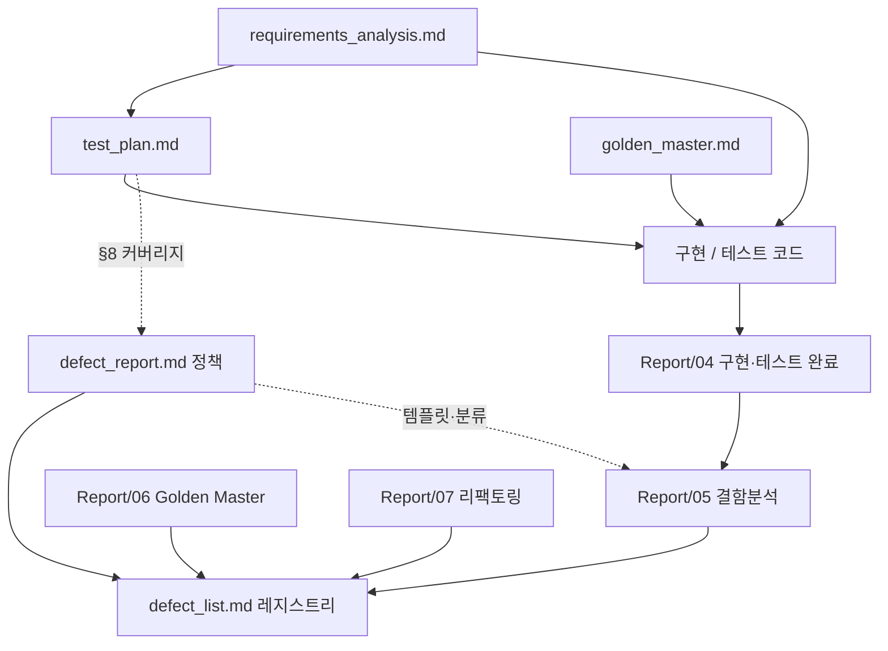

# TDD_TV_Init — 결함 관리 체계 (Defect Management)

| 항목 | 내용 |
|------|------|
| **프로젝트명** | TDD_TV_Init (`bestreviewer`, C++17) |
| **작성일** | 2026-05-19 |
| **문서 버전** | 1.0 |
| **작성 관점** | QA 리드 — TDD·GMock·Golden Master 2계층 회귀 환경 |
| **SSOT** | [`requirements_analysis.md`](requirements_analysis.md), [`test_plan.md`](test_plan.md), [`golden_master.md`](golden_master.md) |

### `defect_list.md`와의 역할 구분

| 문서 | 역할 | 갱신 주기 |
|------|------|-----------|
| **`defect_report.md` (본 문서)** | 분류 체계·보고 템플릿·메트릭·워크플로 **정책** | 체계 변경·분기 리뷰 |
| **`defect_list.md`** | Open/Closed **일일 레지스트리** (`DEF-###`, `OBS-###`) | 결함 등록·해결 시 즉시 |
| **`Report/05.테스트_결함분석.md`** | 사건별 RCA·최소 diff **분석 보고** | 회귀 실패·RCA 수행 시 |

**동기화 규칙**: 정책·템플릿·상태 정의가 충돌하면 **본 문서(`defect_report`)가 우선**한다. 실측 건수·Open 행·OBS는 **`defect_list.md`가 SSOT**이며, 본 문서 §6 스냅샷은 `defect_list`·최근 Report를 요약만 한다(본문 전체 복제 금지).

**검증 기준**: GMock `EXPECT_CALL` (`setCH` / `getCurrentCH` / `seekCH`); `std::cout`는 결함 판단 제외.  
**수정 금지**: `include/Tuner.h`, `test/TunerTest.cpp` — Contract 결함은 기록·외부 이슈 추적만.

---

## 1. 결함 분류 체계

### 1-a) Severity × ItemType 매트릭스 (5×4)

- **행**: ItemType (5종) — Gilded Rose 아이템 타입과 **무관**, 본 프로젝트 정의.
- **열**: Severity (4종) — [`defect_list.md`](defect_list.md) §2 정의 유지.

| ItemType ↓ / Severity → | **Critical** | **Major** | **Minor** | **Info** |
|-------------------------|--------------|-----------|-----------|----------|
| **Production** (`TVController.h`, `remoteKey.h`) | 유효 범위 밖 `setCH("100")` 호출 — **1-5**, E1 | `4,5,6` 후 `CH_UP` 시 `6` 미무효화·잘못 `setCH` — **1-4b** | `99` 업 시 `0` 대신 `100` 시도 — **5-3**, E2 | `std::cout` 포맷·README 문구 불일치(기능 Green) — 문서만 |
| **Test** (`TVControllerTest.cpp`, Mock) | `InSequence` 누락으로 Green인데 계약 검증 누락 — **1-3** | `EXPECT_CALL(setCH("12"))` 인자 오타로 Red — **1-2** | A8 단일 목록 `Times(2)` 기대 오류 — **A8** | GMock Uninteresting call (`getCurrentCH`) — **E14**, OBS-001 |
| **Contract** (`Tuner.h`, 수정 금지) | Tuner가 무효 채널에 미 throw — TunerTest | `seekCH` 빈 문자열 종료 관례와 Controller 루프 불일치 — **4-1** | `getCurrentCH` 반환 형식 관례 불일치 | `TunerTest` 명명·주석과 README 용어 차이 |
| **Environment** (CMake/MSVC/CRT) | `ctest` 0 tests (discovery 실패) | Golden `WORKING_DIRECTORY` 오류로 golden 미발견 — **6-3** | MSVC Debug/Release 경로 혼동 | `cmake_test_discovery_*.json` 미 gitignore |
| **Documentation** (README·requirements) | 명세 0~99와 구현 상한 불일치 — §3.2 | `test_plan` TC-ID와 테스트명 불일치 — **6-4** | Report 날짜·버전만 상이 | requirements §6.2 체크리스트 미갱신 |

#### FunctionalArea 태그 (보조, 6종)

| 태그 | 범위 | 대표 시나리오 |
|------|------|---------------|
| `Digit` | 숫자·확인·버퍼 | 1-1~1-5, 1-4a/b, A1, A2, A7, B1 |
| `Favorite` | 선호 토글 | 2-1, 2-2, A6 |
| `NextFavorite` | 다음 선호 | 3-1, 3-2, A3, E5 |
| `Search` | 채널 검색·결과 저장 | 4-1, A4, A5, E15 |
| `UpDownLinear` | 검색 없음 ±1·래핑 | 5-1~5-4, E2, E3 |
| `UpDownSearch` | 검색 목록 내 이동 | 6-1~6-4, A8, E10 |

결함 등록 시 **FunctionalArea 1개 이상** + **시나리오 ID**(`1-4b`, `A8`, `E14` 등)를 필수로 기록한다.

---

### 1-b) 상태·ID 규칙

| ID 접두사 | 용도 | 예시 |
|-----------|------|------|
| `DEF-###` | 재현 가능한 결함 (테스트 Red 또는 golden diff) | `DEF-001` |
| `OBS-###` | 관찰·Info (테스트 Green, 로그·경고·문서만) | `OBS-001` |
| `REQ-###` | 명세·요구분석 이슈 (구현 전 확정 필요, **선택**) | `REQ-001` |

#### Status 워크플로

```
Open → In Progress → Fixed → Verified (Closed)
                    ↘ Won't Fix
                    ↘ Deferred
```

| Status | 의미 | 레지스트리 반영 |
|--------|------|-----------------|
| **Open** | 재현·수정 전 | `defect_list.md` §3 |
| **In Progress** | 수정·브랜치 작업 중 | 동일 |
| **Fixed** | 코드/테스트 수정 완료, 검증 전 | 동일 |
| **Verified** | `ctest`·단건·golden 재현 Green → **Closed** | §3에서 Closed로 이동 또는 Status=Closed |
| **Won't Fix** | 명세·범위 밖·수용 | 사유·REQ/Report 링크 |
| **Deferred** | 다음 스프린트·Phase | 목표 Phase 태그 |

**Phase 태그** (결함 발견 단계): `요구분석` | `구현` | `단위테스트` | `회귀` | `Golden` | `리팩토링`

---

## 2. 결함 보고서 템플릿

아래 블록을 복사해 `Report/05` §4, GitHub Issue, 또는 스프린트 노트에 붙인다.

```markdown
## [DEF-###] 제목 (한 줄)

| 필드 | 값 |
|------|-----|
| **ID** | DEF-### |
| **Title** | |
| **Severity** | Critical / Major / Minor / Info |
| **ItemType** | Production / Test / Contract / Environment / Documentation |
| **FunctionalArea** | Digit / Favorite / NextFavorite / Search / UpDownLinear / UpDownSearch |
| **Scenario ID** | 예: 1-4b, 6-3, A8, E14 |
| **Status** | Open |
| **Phase** | 단위테스트 / Golden / … |

### 재현 (Steps)

- **Given**: `givenCurrentChannel("6")`, 선호 `{1,4,12}`, 검색 결과 `{4,6,14}` 등
- **When**: 키 시퀀스 — `4` → `5` → `6` → `CH_UP` (또는 `KEY_CH_UP`)
- **Then**: (테스트에서 기대하는 최종 Tuner 상태 요약)

### 기대 (Expected)

- Mock: `EXPECT_CALL(mock, setCH("45")).Times(1);` …
- Golden: `test/golden/scenario_1_4b.golden` 트랜스크립트 (해당 시)
- 참조: `requirements_analysis.md` §…, `test_plan.md` TC-…

### 실제 (Actual)

- GTest/GMock 요약 (한 줄): `Actual function call count doesn't match EXPECT_CALL(setCH("45"))...`
- Golden diff: `--- golden` / `+++ actual` (해당 시)

### 근본원인 (Root Cause)

- 파일·함수·줄: `include/TVController.h` — `pushButton` / `clearBufferIfAny` — L###

### 수정 (Fix)

- 최소 diff 요약 (한 줄)
- **수정 금지 준수**: Tuner.h / TunerTest.cpp 미수정 ☐ 예외 사유

### 검증 (Verification)

- [ ] `ctest --test-dir build --output-on-failure` — Passed / Total
- [ ] `build\Debug\TVControllerTest.exe --gtest_filter=TC_...`
- [ ] `ctest --test-dir build -R GoldenMaster` (해당 시)
- [ ] golden: `UPDATE_GOLDEN` **미사용**, diff 0

### 연계

- `Report/05` §…
- [`defect_list.md`](defect_list.md) 행 …
- GitHub Issue #… (선택)
```

---

## 3. 품질 메트릭 수집 계획

### 3.1 메트릭 정의

| 메트릭 | 정의 | 수집 주기 | 도구/명령 |
|--------|------|-----------|-----------|
| **테스트 통과율** | Passed / Total × 100% | 커밋·PR·일일 | `ctest --test-dir build --output-on-failure` |
| **타깅별 통과** | Tuner / TVController / Golden 각각 | 동일 | `ctest --test-dir build -R TunerTest`; `-R TVControllerTest`; `-R GoldenMaster` 또는 `-L golden` |
| **Open 결함 수** | Status=Open인 `DEF-*` | 결함 등록 시 | [`defect_list.md`](defect_list.md) §1·§3 집계 |
| **결함 발견 단계** | Phase 태그별 건수 | 결함 등록 시 | §1-b Phase 태그 |
| **결함 밀도** | Closed `DEF-*` / KLOC (`TVController.h`) | 스프린트 말 | `cloc include/TVController.h` 또는 수동 |
| **커버리지 (선택)** | `TVController.h` 라인 % | Phase 6·릴리스 | **gcov + lcov** — [`test_plan.md`](test_plan.md) §8 |
| **Golden 불일치** | golden diff 실패 건수 | CI·Golden 실행 시 | `GoldenMasterTest`; CI에서 `UPDATE_GOLDEN` **금지** |

**현재 테스트 규모 (타깅)**: `TunerTest` 13 + `TVControllerTest` 39 + `GoldenMasterTest` 26 = **78** (`Report/06`, `CMakeLists.txt`).

### 3.2 단계별 결함 발견율 (가정·추적용)

실측은 스프린트마다 `defect_list` Closed·Phase 태그로 갱신한다. 아래는 TDD·Golden 도입 **가정 예시**이다.

| 단계 | 범위 | 가정 발견 비중 | 대표 결함 유형 |
|------|------|----------------|----------------|
| P0 (`test_plan` §1.3) | 시나리오 1, 5 | 40% | Production Digit/UpDownLinear; Test Mock 시퀀스 |
| P1 | 시나리오 2~4, 6 | 35% | Search·Favorite; `seekCH` Times |
| P2 | A1~A8, E1~E15 | 15% | Minor 경계; Documentation 명세 정합 |
| 리팩토링 | `TVController.h` 구조 변경 | 5% | Major 회귀 1-4b, 6-3 |
| Golden 도입 전 | GMock만 | — | 세부 계약 누락 잔존 가능 |
| Golden 도입 후 | 26 스냅샷 | 5% | 시나리오 통합 회귀; Environment 경로 |

### 3.3 C++ 커버리지 측정 절차 (gcov + lcov)

`CMakeLists.txt`에 gcov/lcov **미설정** → 본 저장소는 **계획·명령만** 문서화한다. 적용 시 [`test_plan.md`](test_plan.md) §8.4 부록과 동일하게 `ENABLE_COVERAGE` 옵션을 추가한다.

```powershell
# 예: Linux/WSL 또는 MinGW gcov 환경
cmake -B build -DENABLE_COVERAGE=ON
cmake --build build
ctest --test-dir build

lcov --capture --directory build --output-file coverage.info
lcov --remove coverage.info '/usr/*' '*/googletest/*' '*/test/*' --output-file coverage.filtered.info
genhtml coverage.filtered.info --output-directory build/coverage_html
```

| 목표 (참고) | 파일 | 목표 라인 % |
|-------------|------|-------------|
| Controller | `include/TVController.h` | 90%+ (팀 협의 85% 가능) |
| Keys | `include/remoteKey.h` | 100% |
| 제외 | `Tuner.h`, `test/`, `std::cout` | — |

Windows(MSVC)는 **OpenCppCoverage** / **llvm-cov** 등 도구로 대체 가능(동일 목표·제외 규칙).

### 3.4 타 언어 참고 (본 저장소 비적용)

JaCoCo(Java)·pytest-cov(Python)은 **본 C++ 저장소에 미적용**한다. 다언어 프로젝트 비교 시 “라인 커버리지 + 테스트 제외 경로 필터” 개념만 동일하게 이식한다.

---

## 4. 문서·Report 연계



**텍스트 요약**

```
requirements_analysis → test_plan → 구현/테스트
         ↓                      ↓
defect_report (정책)   Report/04, 05, 06, 07
         ↓
defect_list (레지스트리, Open/Closed)
```

| 산출물 | 링크 |
|--------|------|
| 명세 SSOT | [`docs/requirements_analysis.md`](requirements_analysis.md) |
| 테스트 계획·P0~P2·§8 | [`docs/test_plan.md`](test_plan.md) |
| Golden 거버넌스 | [`docs/golden_master.md`](golden_master.md) |
| 일일 레지스트리 | [`docs/defect_list.md`](defect_list.md) |
| RCA·최소 diff | [`Report/05.테스트_결함분석.md`](../Report/05.테스트_결함분석.md) |
| 체계 도입 완료 | [`Report/08.결함관리체계_완료보고서.md`](../Report/08.결함관리체계_완료보고서.md) |

---

## 5. (선택) GitHub Issues 연동 워크플로

### 5.1 Label 규칙

| 축 | Label 예시 |
|----|----------------|
| Severity | `severity:critical`, `severity:major`, `severity:minor`, `severity:info` |
| ItemType | `type:production`, `type:test`, `type:contract`, `type:environment`, `type:documentation` |
| FunctionalArea | `area:digit`, `area:favorite`, `area:next-favorite`, `area:search`, `area:updown-linear`, `area:updown-search` |
| Status | `status:open`, `status:in-progress`, `status:verified` |

Issue 본문은 **§2 템플릿**을 사용한다.

### 5.2 PR·레지스트리 연계

1. PR 본문: `Fixes #123` (또는 `Closes #123`)
2. Merge 후 QA: `ctest` Green → Issue closed → `defect_list.md` 해당 `DEF-*` Status **Verified (Closed)**
3. **CI에서 `ctest` 실패 시 Issue 자동 생성은 권장하지 않음** (flake·환경 노이즈). 실패는 로그 보관 후 **수동 QA 등록**.

---

## 6. 현재 스냅샷 (2026-05-19)

> 실측 SSOT: [`defect_list.md`](defect_list.md), [`Report/05`](../Report/05.테스트_결함분석.md), [`Report/06`](../Report/06.GoldenMaster_회귀테스트_완료보고서.md).

### 6.1 결함·관찰 요약

| 구분 | 건수 |
|------|------|
| **Open** (`DEF-*`) | **0** |
| **Closed** (`DEF-*`) | 0 |
| **관찰** (`OBS-*`) | **1** (`OBS-001`, Info/Test, E14) |

### 6.2 테스트 통과 (2계층)

| 타깅 | Passed / Total | 비고 |
|------|----------------|------|
| `TunerTest` | 13 / 13 | Contract 참고, 수정 금지 |
| `TVControllerTest` | 39 / 39 | GMock 계약 |
| `GoldenMasterTest` | 26 / 26 | `test/golden/*.golden` |
| **합계** | **78 / 78** | 실패 0 (`Report/06`) |

**판정**: GMock·Golden 기준 **재현 가능한 생산 결함 0건**. `OBS-001`은 E14 방어 동작 검증 중 GMock 경고만 존재(기능 결함 아님).

### 6.3 고위험 회귀 시나리오 (요약)

[`defect_list.md`](defect_list.md) §5와 동일 — 현재 **모두 Green**.

| 시나리오 | 대표 테스트 / Golden | 가정 실패 Severity | FunctionalArea |
|----------|----------------------|--------------------|----------------|
| **1-4b** | `TC_1_4b_*` / `scenario_1_4b.golden` | Major | Digit |
| **6-3** | `TC_6_3_*` / `scenario_6_3.golden` | Major | UpDownSearch |
| **A8** | `TC_A8_*` / `scenario_A8.golden` | Minor | UpDownSearch |
| **E14** | `TC_ERR_InvalidCurrentChUpNoOp` | Major | UpDownLinear |

리팩토링·`TVController.h` 변경 후 **우선** `ctest` 전체 → 위 4건 단건·Golden `-R GoldenMaster`.

### 6.4 빠른 검증 명령

```powershell
cmake -B build
cmake --build build
ctest --test-dir build --output-on-failure
ctest --test-dir build -R GoldenMaster
```

---

## 7. 변경 이력

| 일자 | 버전 | 내용 |
|------|------|------|
| 2026-05-19 | 1.0 | 초판 — 결함 관리 체계·템플릿·메트릭·문서 연계; `defect_list`와 역할 분리 |

---

## 8. 관련 문서

- [`defect_list.md`](defect_list.md) — Open/Closed 레지스트리
- [`Report/04.구현_테스트_완료보고서.md`](../Report/04.구현_테스트_완료보고서.md)
- [`Report/05.테스트_결함분석.md`](../Report/05.테스트_결함분석.md)
- [`Report/06.GoldenMaster_회귀테스트_완료보고서.md`](../Report/06.GoldenMaster_회귀테스트_완료보고서.md)
- [`Report/08.결함관리체계_완료보고서.md`](../Report/08.결함관리체계_완료보고서.md)
- [`README.md`](../README.md) — 빌드·Golden 갱신 스니펫
