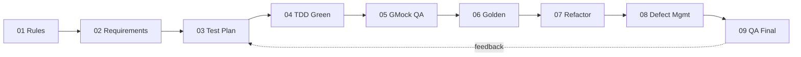

# TDD_TV_Init — QA 종합 검토 최종 보고서 (9단계)

| 항목 | 내용 |
|------|------|
| **프로젝트명** | TDD_TV_Init (`bestreviewer`, C++17) |
| **작성일** | 2026-05-19 |
| **작성 관점** | QA 리드 — TDD·GMock·Golden Master 2계층 회귀·문서 SSOT 정합성 |
| **실측 (`ctest`)** | **78 / 78 Passed (100%)**, 실패 0, Total Test time ≈ 1.75s (`cmake --build build` 후 `ctest --test-dir build --output-on-failure`) |
| **선행 보고** | [`Report/01`](../Report/01.CursorRules_설계보고서.md) ~ [`Report/08`](../Report/08.결함관리체계_완료보고서.md) |
| **요약본** | [`Report/09.QA종합검토_최종보고서.md`](../Report/09.QA종합검토_최종보고서.md) (선택) |

### 문서 SSOT·연계

| 역할 | 경로 |
|------|------|
| 요구사항 SSOT | [`requirements_analysis.md`](requirements_analysis.md) (§1~6, A1~A8, E1~E15) |
| 테스트 계획 | [`test_plan.md`](test_plan.md) (P0~P2, §8 커버리지) |
| Golden 거버넌스 | [`golden_master.md`](golden_master.md) |
| 결함 정책 | [`defect_report.md`](defect_report.md) |
| 결함 레지스트리(실측) | [`defect_list.md`](defect_list.md) |
| 품질·구조 | [`analysis.md`](analysis.md), [`refactoring_log.md`](refactoring_log.md) |
| 리팩토링 활동 | [`Report/07`](../Report/07.TVController_리팩토링_완료보고서.md) |

---

## 1. 테스트 완료율·커버리지

### 1.1 `ctest` 실측 (본 검토 시점)

| 타깅 | Passed | Total | 통과율 | 비고 |
|------|--------|-------|--------|------|
| `TunerTest` | 13 | 13 | 100% | Contract 참고, **수정 금지** |
| `TVControllerTest` | 39 | 39 | 100% | GMock `EXPECT_CALL` 계약 |
| `GoldenMasterTest` (`-L golden`) | 26 | 26 | 100% | `test/golden/*.golden`, `WORKING_DIRECTORY` = 소스 루트 |
| **합계** | **78** | **78** | **100%** | 목표 78/78 달성 |

```text
100% tests passed, 0 tests failed out of 78
Label Time Summary: golden = 0.51 sec*proc (26 tests)
Total Test time (real) = 1.75 sec
```

**타깅별 빠른 실행**

```powershell
ctest --test-dir build -R TunerTest --output-on-failure
ctest --test-dir build -R TVControllerTest --output-on-failure
ctest --test-dir build -L golden --output-on-failure
```

### 1.2 `requirements_analysis.md` §6 시나리오 ↔ GMock·Golden 매핑

> **§6.1** README 시나리오 1~6 (19건), **§6.2** 경계·모호 A1~A8 (8건). Golden은 **26건**(A5 제외). GMock은 **39건**(§6 전건 + B1·E5·E15·E14·보강·`TEST_P` 2건).

| 시나리오 | FunctionalArea | GMock (`TVControllerTest`) | Golden (`GoldenMasterTest`) |
|----------|----------------|----------------------------|-----------------------------|
| **1-1** | Digit | `TC_1_1_OneDigitThenOk` | `Scenario_1_1_OneDigitThenOk` |
| **1-2** | Digit | `TC_1_2_TwoDigitsImmediateNoOk` | `Scenario_1_2_TwoDigitsImmediate` |
| **1-3** | Digit | `TC_1_3_FourDigitsTwelveThenThirtyFour` | `Scenario_1_3_FourDigitsTwelveThenThirtyFour` |
| **1-4a** | Digit | `TC_1_4a_FourFiveSixThenOk` | `Scenario_1_4a_FourFiveSixThenOk` |
| **1-4b** | Digit | `TC_1_4b_FourFiveSixUpInvalidatesSix` | `Scenario_1_4b_FourFiveSixUpInvalidatesSix` |
| **1-5** | Digit | `TC_1_5_ZeroSeven` | `Scenario_1_5_ZeroSeven` |
| **2-1** | Favorite | `TC_2_1_AddFavoriteNoSetCh` | `Scenario_2_1_AddFavoriteNoSetCh` |
| **2-2** | Favorite | `TC_2_2_RemoveFavoriteNoSetCh` | `Scenario_2_2_RemoveFavoriteNoSetCh` |
| **3-1** | NextFavorite | `TC_3_1_NextFavoriteToTwelve` | `Scenario_3_1_NextFavoriteToTwelve` |
| **3-2** | NextFavorite | `TC_3_2_NextFavoriteRotateToOne` | `Scenario_3_2_NextFavoriteRotateToOne` |
| **4-1** | Search | `TC_4_1_SearchUntilEmpty` | `Scenario_4_1_SearchUntilEmpty` |
| **5-1** | UpDownLinear | `TC_5_1_ChannelUpFromSix` | `Scenario_5_1_ChannelUpFromSix` |
| **5-2** | UpDownLinear | `TC_5_2_ChannelDownFromSix` | `Scenario_5_2_ChannelDownFromSix` |
| **5-3** | UpDownLinear | `TC_5_3_NinetyNineUpWrapsToZero` | `Scenario_5_3_NinetyNineUpWrapsToZero` |
| **5-4** | UpDownLinear | `TC_5_4_ZeroDownWrapsToNinetyNine` | `Scenario_5_4_ZeroDownWrapsToNinetyNine` |
| **6-1** | UpDownSearch | `TC_6_1_SearchUpFromSixToFourteen` | `Scenario_6_1_SearchUpFromSixToFourteen` |
| **6-2** | UpDownSearch | `TC_6_2_SearchDownFromSixToFour` | `Scenario_6_2_SearchDownFromSixToFour` |
| **6-3** | UpDownSearch | `TC_6_3_SearchUpFromFifteenToFour` | `Scenario_6_3_SearchUpFromFifteenToFour` |
| **6-4** | UpDownSearch | `TC_6_4_SearchDownFromFifteenToFourteen` | `Scenario_6_4_SearchDownFromFifteenToFourteen` |
| **A1** | Digit | `TC_A1_EmptyBufferOkNoOp` | `Scenario_A1_EmptyBufferOkNoOp` |
| **A2** | Digit | `TC_A2_NineNineConfirm` | `Scenario_A2_NineNineConfirm` |
| **A3** | NextFavorite | `TC_A3_NoFavoritesNoOp` | `Scenario_A3_NoFavoritesNoOp` |
| **A4** | Search | `TC_A4_EmptySearchThenPlusOne` | `Scenario_A4_EmptySearchThenPlusOne` |
| **A5** | Search | `TC_A5_SecondSearchReplacesResults` | — (GMock·`InSequence` 전담) |
| **A6** | Favorite | `TC_A6_FavToggleClearsDigitBuffer` | `Scenario_A6_FavToggleClearsDigitBuffer` |
| **A7** | Digit | `TC_A7_OneDigitOnlyNoSetCh` | `Scenario_A7_OneDigitOnlyNoSetCh` |
| **A8** | UpDownSearch | `TC_A8_SingleSearchResultWrap` | `Scenario_A8_SingleSearchResultWrap` |
| **E14** | UpDownLinear | `TC_ERR_InvalidCurrentChUpNoOp` | — (no-op·트랜스크립트 빈약) |
| **B1** (경계) | Digit / UpDownLinear | `TC_DIG_SingleZeroThenOk`, `TC_DIG_NinetyNineBoundary`, `TC_5_ChannelOneUpToTwo` | — |
| **E5** (§9.1) | NextFavorite | `TC_NFAV_SingleFavoriteRotateToSelf` | — |
| **E15** | Search / Digit | `TC_SRCH_ClearsBufferBeforeSearch` | — |
| (보강) | Favorite / Search | `TC_FAV_ToggleTwice…`, `TC_FAV_AddMultipleChannels`, `TC_NFAV_FromTwelveToFiftySix`, `TC_SRCH_DedupSortViaNavigate` | — |
| (보강) | UpDownLinear | `WrapChannelBoundary` (`TEST_P` ×2) | — |

**§6 시나리오 커버리지 판정**

| 구분 | 건수 | GMock | Golden |
|------|------|-------|--------|
| §6.1 (1-1~6-4) | 19 | 19/19 ✅ | 19/19 ✅ |
| §6.2 (A1~A8) | 8 | 8/8 ✅ | 7/8 (A5만 Golden 제외) ✅ |
| **합계** | **27** | **27/27** | **26/27** (의도적 2계층 분리) |

### 1.3 코드 커버리지 (gcov/lcov)

| 항목 | 상태 |
|------|------|
| `CMakeLists.txt` | `ENABLE_COVERAGE` / gcov·lcov **미설정** |
| **실측 라인 %** | **없음** (본 검토에서 측정 미수행) |
| 목표 ([`test_plan.md`](test_plan.md) §8) | `TVController.h` **90%+**, `remoteKey.h` **100%** |
| **갭·리스크** | 미측정 구간(에러 분기·모든 `remoteKey` case·`seekCH` 상한 루프 등)의 **잔여 위험을 정량화 불가**; 회귀는 78건 테스트·Golden에 의존 |
| Windows | OpenCppCoverage / llvm-cov 등 대체 가능 ([`defect_report.md`](defect_report.md) §3.3) |

**정성적 커버 추정** (테스트 매핑 기반, **수치 아님**)

| 대상 | 추정 | 근거 |
|------|------|------|
| `remoteKey.h` | 높음 (~100%에 근접 가능) | 모든 키가 시나리오·테스트 경로에 등장 |
| `TVController.h` (~584 LOC) | 중~높음 (90% 미확정) | §6+A/E/B1 대부분 분기 통과; Phase 4b·5·6 미적용 코드·방어 분기는 미검증 가능 |
| `Tuner.h` | N/A (제외) | Contract는 `TunerTest` 13건 |

### 1.4 미측정·잔여 항목

| ID | 내용 | 현재 완화 | 권장 후속 |
|----|------|-----------|-----------|
| **A5** | 재검색 결과 교체 | `TC_A5_SecondSearchReplacesResults` (GMock) | 선택: 2단계 Golden 스냅샷 ([`Report/06`](../Report/06.GoldenMaster_회귀테스트_완료보고서.md)) |
| **E14** | 무효 `getCurrentCH` no-op | `TC_ERR_InvalidCurrentChUpNoOp` | OBS-001 정리(§2); Golden 비대상 유지 가능 |
| **gcov** | §8 목표 90%+ | 78/78 Green | `ENABLE_COVERAGE` 옵션 + lcov 1회 실측 |
| **리팩 Phase 4~6** | 버퍼 캡슐화, `upper_bound`, `from_chars`, 로그 래퍼 | Phase 1~3 완료, 78 Green | 단계별 적용 + `ctest -L golden` ([`refactoring_log.md`](refactoring_log.md), [`Report/07`](../Report/07.TVController_리팩토링_완료보고서.md) §9) |
| **문서 드리프트** | `analysis.md`·`.cursorrules`의 GTest 1.14.0 표기 vs `CMakeLists.txt` 1.16.0 | 기능 무관 | SSOT 일괄 갱신 |

---

## 2. 결함 패턴 분석

### 2.1 레지스트리 실측 ([`defect_list.md`](defect_list.md) SSOT)

| 구분 | 건수 |
|------|------|
| **Open** (`DEF-*`) | **0** |
| **Closed** (`DEF-*`) | 0 |
| **관찰** (`OBS-*`) | **1** (`OBS-001`) |
| **테스트** | 78/78 Passed |

[`Report/05`](../Report/05.테스트_결함분석.md): 구현 완료 후 GMock 회귀에서 **재현 가능한 생산 결함 0건** 기록. Golden·리팩토링(`Report/06`·`07`) 이후에도 동일.

### 2.2 ItemType(5) × Severity(4) — 등록·잠재 ([`defect_report.md`](defect_report.md) §1-a)

**실측 등록 (Open 0)**

| ItemType ↓ / Severity → | Critical | Major | Minor | Info |
|-------------------------|----------|-------|-------|------|
| Production | 0 | 0 | 0 | 0 |
| Test | 0 | 0 | 0 | **1** (OBS-001, Closed 아님) |
| Contract | 0 | 0 | 0 | 0 |
| Environment | 0 | 0 | 0 | 0 |
| Documentation | 0 | 0 | 0 | 0 |

**OBS-001**: `TC_ERR_InvalidCurrentChUpNoOp` — GMock Uninteresting `getCurrentCH`; **기능 Green**, E14 방어 검증 목적.

**Open 0일 때 FunctionalArea별 고위험 잠재 결함** (회귀 Red 시 우선 조사)

| FunctionalArea | 시나리오 | 가정 실패 Severity | ItemType | 대표 검증 |
|----------------|----------|-------------------|----------|-----------|
| **Digit** | **1-4b** | Major | Production / Test | `TC_1_4b_*`, `scenario_1_4b.golden` |
| **UpDownSearch** | **6-3** | Major | Production | `TC_6_3_*`, `scenario_6_3.golden` |
| **UpDownSearch** | **A8** | Minor | Production / Test | 단일 검색 목록 `setCH` Times |
| **UpDownLinear** | **E14** | Major | Production | `getCurrentChannelValue()` null → no-op |
| **Search** | **A5** | Major | Production | 2차 검색 후 목록 교체·업/다운 분기 |
| **Search** | **4-1** | Major | Contract/Test | `seekCH` until `""`, Times·`InSequence` |
| **NextFavorite** | **3-2** | Major | Production | 로테이션 → 최소 선호 |
| **Favorite** | **2-1/2-2** | Minor | Production | `setCH` Times(0), 토글 |

상세 표는 [`defect_list.md`](defect_list.md) §5, [`defect_report.md`](defect_report.md) §6.3과 동일 기준.

### 2.3 결함 발견 단계 (가정 분포, 실측 Closed 0)

[`defect_report.md`](defect_report.md) §3.2의 P0~P2·Golden 단계별 **가정 비중**은 참고용이다. 본 프로젝트는 TDD로 **구현 단계에서 결함을 테스트에 흡수**한 형태로, Formal `DEF-*` 등록 없이 Green 도달. 후속 레거시 프로젝트에서는 Phase 태그로 **실측 발견율**을 쌓는 것을 권장한다.

---

## 3. 9단계 QA 파이프라인 — 효과·개선

| # | 단계 | 주요 산출물 | 효과 | 개선 (1줄) |
|---|------|-------------|------|------------|
| 1 | CursorRules·설계 | [`Report/01`](../Report/01.CursorRules_설계보고서.md), [`.cursorrules`](../.cursorrules) | ✅ Tuner 수정 금지·TDD·Mock 규칙이 이후 모든 턴의 **가드레일**로 작동 | GTest 버전을 `CMakeLists.txt`(1.16.0)와 SSOT 동기화 |
| 2 | 요구사항 정밀 분석 | [`Report/02`](../Report/02.요구사항분석_보고서.md), [`requirements_analysis.md`](requirements_analysis.md) | ✅ §6 Given-When-Then·§2 모호 해소가 Red 테스트의 **단일 기준** | E5·A8 등 §9 결정안을 requirements 본문에 인라인 반영 |
| 3 | 테스트 계획 (P0~P2) | [`Report/03`](../Report/03.테스트계획_보고서.md), [`test_plan.md`](test_plan.md) | ✅ P0→P1→P2·TC-ID 추적으로 **52→78** 확장 경로 명확 | Phase 6 커버리지를 “선택”에서 CI **게이트**(임계 85~90%)로 승격 검토 |
| 4 | Red→Green 구현 | [`Report/04`](../Report/04.구현_테스트_완료보고서.md), `TVControllerTest` 39 | ✅ README 6영역·A/E/B1 GMock **전건 Green** | `TEST_P`로 B1·Wrap 중복을 더 압축해 유지보수성 향상 |
| 5 | GMock 회귀·결함 분석 | [`Report/05`](../Report/05.테스트_결함분석.md), [`defect_list.md`](defect_list.md) | ✅ Open 0·고위험 시나리오 표준화; OBS-001만 잔존 | OBS-001: `EXPECT_CALL(getCurrentCH()).Times(1)`로 경고 제거 |
| 6 | Golden Master 회귀 | [`Report/06`](../Report/06.GoldenMaster_회귀테스트_완료보고서.md), 26 golden, `-L golden` | ✅ 시나리오 **통합 트랜스크립트** 2차 잠금; 리팩 후에도 78 Green | A5 2단계 스냅샷 추가 여부 팀 합의 |
| 7 | 리팩토링 (동작 불변) | [`Report/07`](../Report/07.TVController_리팩토링_완료보고서.md), [`refactoring_log.md`](refactoring_log.md) | ✅ Phase 1~3, **78/78** 유지; 이중 parse·업/다운 중복 해소 | Phase 4~6는 **커밋·문서 1 Phase = 1 log 행** 규칙 고정 |
| 8 | 결함 관리 체계 | [`Report/08`](../Report/08.결함관리체계_완료보고서.md), [`defect_report.md`](defect_report.md) | ✅ 정책/레지스트리 분리·5×4 매트릭스·메트릭 계획 | PR 템플릿에 §2 결함 템플릿 블록 링크 |
| 9 | **QA 종합 검토** | **본 문서**, [`Report/09`](../Report/09.QA종합검토_최종보고서.md) | ✅ 파이프라인 **폐루프**·잔여 리스크·Best Practice 정리 | 릴리스 전 체크: `ctest` + (선택) lcov + `defect_list` 동기화 |



---

## 4. 다음 레거시(C++ Controller·TDD) 프로젝트 Best Practice 5가지

1. **Mock vs Golden 역할 분리**  
   - **1계층 (GMock)**: `setCH` / `getCurrentCH` / `seekCH`의 인자·횟수·순서·`InSequence`.  
   - **2계층 (Golden)**: `RecordingTuner` 트랜스크립트로 README 시나리오 **End-to-End** 잠금.  
   - **GMock 전담**: A5(다단계 Mock), E14(no-op), B1·E5·내부 상태 보강 — Golden에 억지로 넣지 않음 ([`golden_master.md`](golden_master.md)).

2. **Tuner Contract 고정**  
   - `include/Tuner.h` + `TunerTest.cpp`를 **외부 SSOT**로 두고, Controller는 생성자 주입 `Tuner*` + Mock/Fake만.  
   - Contract 변경 필요 시 **별도 이슈·버전**; Controller 테스트로 Tuner 시그니처를 바꾸지 않음 (`.cursorrules` 절대 규칙).

3. **문서 SSOT 삼각형**  
   - `requirements_analysis.md` (무엇을) ↔ `test_plan.md` (어떻게 검증) ↔ `defect_list.md` (실측 Open/OBS).  
   - Report는 **활동 기록**, docs는 **운영 SSOT**; 실측 건수는 `defect_list`만 신뢰.

4. **`ctest -L golden` CI 게이트**  
   - `gtest_discover_tests(... PROPERTIES LABELS golden)` + `WORKING_DIRECTORY ${CMAKE_SOURCE_DIR}`.  
   - PR: 전체 `ctest` + Golden 라벨; `UPDATE_GOLDEN=1`은 **로컬·명시 PR만** ([`README.md`](../README.md)).

5. **리팩토링 Phase 쪼개기**  
   - Green 유지 하에 Phase 1(상수)·2(dedupe)·3(함수 분해) → **각 Phase 후 `ctest` 78 + `-L golden`**.  
   - Phase 4b(`upper_bound`)·5(`from_chars`)·6(로그)는 **동작·트랜스크립트 동등**을 Golden으로 재확인 ([`Report/07`](../Report/07.TVController_리팩토링_완료보고서.md) §9).

---

## 5. Cursor AI 활용 효과 (정량·정성)

> **과장 금지**: 아래 “가속”은 Prompt·Report 구조 기반 **정성 추정**이며, 인력·일정 대비 **N% 단축은 실측 없음**.

### 5.1 정량 (저장소 기준, 2026-05-19)

| 지표 | 값 | 비고 |
|------|-----|------|
| `Report/*.md` | 8 → 9 (본 9단계 포함) | 단계별 완료 보고 |
| `Prompting/*.md` | 9 | 단계별 재현 가능 프롬프트 |
| `docs/*.md` (품질·명세) | 8+ | requirements, test_plan, golden_master, defect_*, analysis, refactoring_log, 본 qa_final |
| 테스트 규모 | 0 → **78** | Tuner 13 + Controller 39 + Golden 26 |
| `TVController.h` | 스켈레톤 → **~584 LOC** | 헤더 중심 구현 |
| `ctest` (최종) | **78/78** | 본 검토 실측 |
| Formal `DEF-*` Closed | **0** | TDD·회귀로 사전 흡수 |
| `OBS-*` | **1** | 테스트 품질(경고)만 |

### 5.2 정성

| 영역 | 효과 | 한계 |
|------|------|------|
| **문서** | §6 시나리오·P0~P2·결함 매트릭스를 **한 턴에 SSOT화** → Red 작성 시 할루시네이션 감소 | `analysis.md` 등 초기 스냅샷 **미갱신** 드리프트 |
| **테스트** | `TunerTest` 패턴·`EXPECT_CALL` 보일러플레이트 **복제 가속** | Mock 과다 시나리오(A5)는 사람 검토 필수 |
| **리팩토링** | Phase 1~3 **일괄 제안·적용** + 78 Green 유지 ([`Report/07`](../Report/07.TVController_리팩토링_완료보고서.md)) | Phase 4~6은 **미적용** — AI가 “완료”로 오인하기 쉬움 |
| **결함** | Open 0 시점 **조기 안정** 인상; OBS-001 수준 관찰 분리 | `std::cout`·커버리지 **비검증** |
| **환경** | Windows PowerShell·`build\Debug\` 경로 스니펫 | gcov·WSL 대비 **도구链**은 수동 |
| **계약** | `.cursorrules`로 `Tuner.h` 수정 **억제** 성공 | Contract 불일치 시 **기록만** 가능(수정 불가) |

### 5.3 재현 가능 워크플로 (다음 프로젝트)

1. `Prompting/01` → `.cursorrules`  
2. `02` → `requirements_analysis.md`  
3. `03` → `test_plan.md`  
4. `04` → Red/Green (`TVControllerTest`)  
5. `05`~`08` → 회귀·Golden·리팩·결함 체계  
6. `09` → 본 QA 종합 ( **`ctest` 실측 필수** )

---

## 6. 최종 판정 (Executive Summary)

1. **기능·회귀**: `ctest` **78/78 (100%)** — GMock 39 + Golden 26 + Tuner Contract 13; [`defect_list.md`](defect_list.md) **Open 0**, 생산 결함 **0건**.  
2. **명세 추적**: `requirements_analysis.md` §6.1~6.2 **27/27 GMock**, Golden **26/27**(A5·E14는 GMock 전담, **의도적**).  
3. **품질 갭**: **gcov/lcov 실측 없음** — `test_plan.md` §8 목표(90%+) 대비 **정량 커버리지 미확인**이 최대 잔여 리스크.  
4. **관찰·리팩**: `OBS-001`(Info) 1건; 리팩 **Phase 4~6 미적용** — 구조·성능·로그 개선 여지 있음.  
5. **권장**: 아래 우선순위로 후속; 파이프라인 1~8은 **재사용 가능한 레거시 TDD 템플릿**으로 판정.

### 후속 우선순위

| 우선순위 | 항목 | 근거 | 산출 |
|----------|------|------|------|
| **P0** | gcov/lcov(또는 OpenCppCoverage) 1회 실측 | §8 목표·미측정 분기 | `build/coverage_html`, % 수치 |
| **P1** | OBS-001 정리 | GMock 경고·테스트 가독성 | `defect_list` OBS Closed 또는 유지 결정 |
| **P2** | 리팩 Phase 4b (`upper_bound`) | 6-x·A8 회귀 민감 | `refactoring_log` + 78 Green |
| **P3** | 리팩 Phase 5~6 | 파싱·로그 (Golden 문자열 동일 주의) | 동일 |
| **P4** | A5 Golden (선택) | 2계층 완전 대칭 | `scenario_A5.golden` |
| **P5** | docs SSOT 드리프트 수정 | GTest 버전·`analysis.md` 타깅 수 | 일관된 onboarding |

---

## 7. 변경 이력

| 일자 | 버전 | 내용 |
|------|------|------|
| 2026-05-19 | 1.0 | QA 9단계 종합 검토 초판 — `ctest` 78/78 실측 반영 |

---

*본 문서는 TDD_TV_Init QA 파이프라인 **9단계(최종)** 산출물이다. 실측 Open/OBS·테스트 건수는 [`defect_list.md`](defect_list.md)와 모순 없이 유지한다.*
